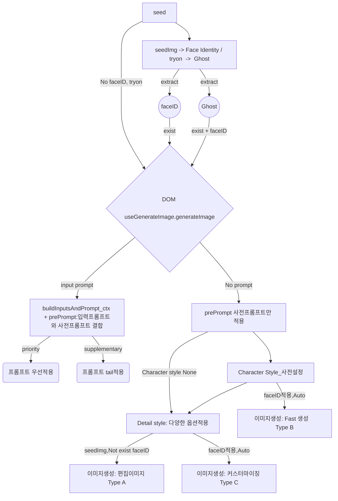

### 로직 설명 
제시된 순서도는 시드(seed) 이미지를 기반으로 프롬프트를 적용하여 이미지를 생성하는 전체 흐름을 나타낸다.

### 1. 초기 입력 및 특징 추출
프로세스는 최초의 기준 이미지인 'seed'에서 시작한다. 이 시드 이미지는 두 가지 경로로 처리된다.

*   **직접 사용**: 별도의 특징 추출 없이 이미지 생성 함수(`useGenerateImage.generateImage`)의 입력으로 바로 사용될 수 있다.
*   **특징 추출**: 시드 이미지에서 'Face Identity(faceID)'와 'Ghost'라는 두 가지 핵심 요소를 사전에 추출한다. 추출된 'faceID'는 인물 정체성 유지를 위해, 'Ghost'는 포즈나 구도 등 구조적 일관성을 위해 사용된다. 이 추출된 요소들은 이미지 생성 단계에서 선택적으로 적용된다.

### 2. 프롬프트 적용 및 분기
이미지 생성의 핵심 단계(`useGenerateImage.generateImage`)에서는 사용자 프롬프트 입력 여부에 따라 로직이 분기된다.

*   **사용자 프롬프트가 있는 경우**: 사용자가 입력한 프롬프트는 시스템에 내장된 '사전 프롬프트(prePrompt)'와 결합된다(`buildInputsAndPrompt_ctx`). 결합 방식은 두 가지로 나뉜다.
    *   **우선 적용(priority)**: 사용자 프롬프트를 우선적으로 고려하여 이미지를 생성한다.
    *   **보조 적용(supplementary)**: 사전 프롬프트 뒤에 사용자 프롬프트를 추가(tail)하여 보조적인 지시어로 활용한다.

*   **사용자 프롬프트가 없는 경우**: 사전 프롬프트만이 적용되어 이미지의 기본 스타일과 내용을 결정한다. 이 경우, 사전에 설정된 스타일 규칙에 따라 이미지가 생성된다.

### 3. 스타일 적용 및 최종 이미지 생성
사전 프롬프트만 적용되는 경우, 다시 세부 스타일 설정에 따라 생성 방식이 나뉜다.

1.  **캐릭터 스타일(Character Style) 적용**: 사전 설정된 캐릭터 스타일을 선택하면, 'faceID'와 결합하여 **Type B(Fast 생성)** 이미지를 빠르게 생성한다.
2.  **세부 스타일(Detail Style) 적용**: 캐릭터 스타일을 선택하지 않거나, 선택 후 추가 옵션을 적용하는 경우 세부 스타일 단계로 넘어간다. 이 단계에서는 조건에 따라 두 가지 유형의 이미지가 생성된다.
    *   **Type A(편집 이미지)**: 'faceID' 없이 시드 이미지만 있는 상태에서 세부 스타일 옵션을 적용하여 이미지를 편집하거나 변형한다.
    *   **Type C(커스터마이징)**: 'faceID'가 적용된 상태에서 세부 스타일 옵션을 활용하여 사용자 맞춤형 이미지를 생성한다.
